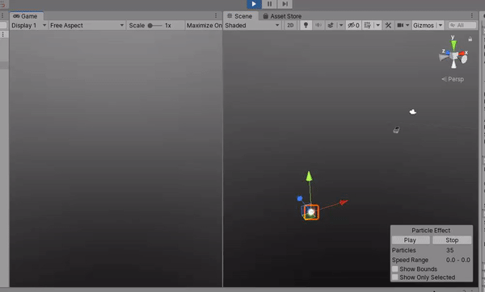
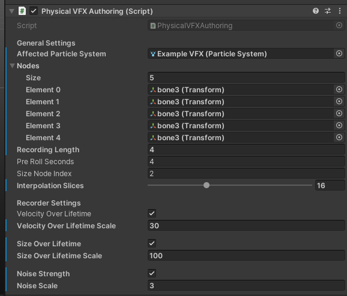
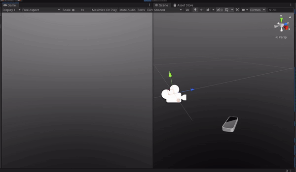

# VFX-Theremin
## Unity Physical VFX authoring tool

As with many other of my experiments, this small project started from a core design philosophy of mine: the mouse and keyboard aren’t really the best tools to express heartfelt, visceral artistic ideas and as digital creators, we often revert to our own bodies and pre-digital instincts to act out our ideas. Why not take advantage of that?

Who hasn’t grimaced at a nearby mirror as a reference for an illustration, gesticulated to other team members to describe the pace and gait of a certain character or (and this is where this project comes in) wiggled around our fingers to explain how a tuft of smoke should behave?

With this small Unity package, you can now use your Leap Motion (mine was gathering dust in a box somewhere) to save some time when authoring particle systems. Simply add the PhysicalVFXAuthoring component to your scene, record a few seconds off the Leap Motion and watch your particle system automatically assemble itself based on your movements. It obviously won’t do all the work for you - but it’ll save that tedious first iteration that we all hate.

**While you will pretty much need a Leap Motion for this to work as intended you can use it without one also - you just need stuff to track (like motion controllers). If you *do* go the Leap Motion route, you'll need the Leap Motion core assets that can be found [here](https://developer.leapmotion.com/unity#5436356).**

### Instructions

1. Add the PhysicalVFXAuthoring component to a game object in your scene. The scene must also contain the gameobjects that will be tracked in world space (eg. the leapmotion capsule hand fingers).
2. In the PhysicalVFXAuthoring script, assign:
- The affected particle system
- The gameobjects that will affect the final animations (here called nodes)
- The recording length, preroll length and recorder framerate
- The size node index - this takes distance from the first node to this node to scale the system as we record. With the demo setup, this matches the middle finger.
- The various scales and features of the different things you can record.

3. Press record, watch the console for preroll and move! Once it stops recording changes with be applied automatically.

### Possible Future Iterations
- Oculus Quest Hand Tracking (if it makes it with the Quest Link)
- HDRP VFX Graph Compatibility
- Unreal Version

Made in a few hours at [Imaginary Spaces](https://imaginary-spaces.com/). Thanks Benoît!
